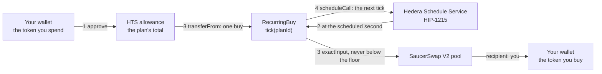
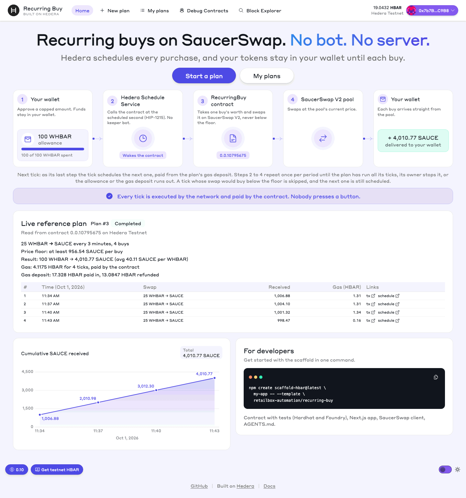
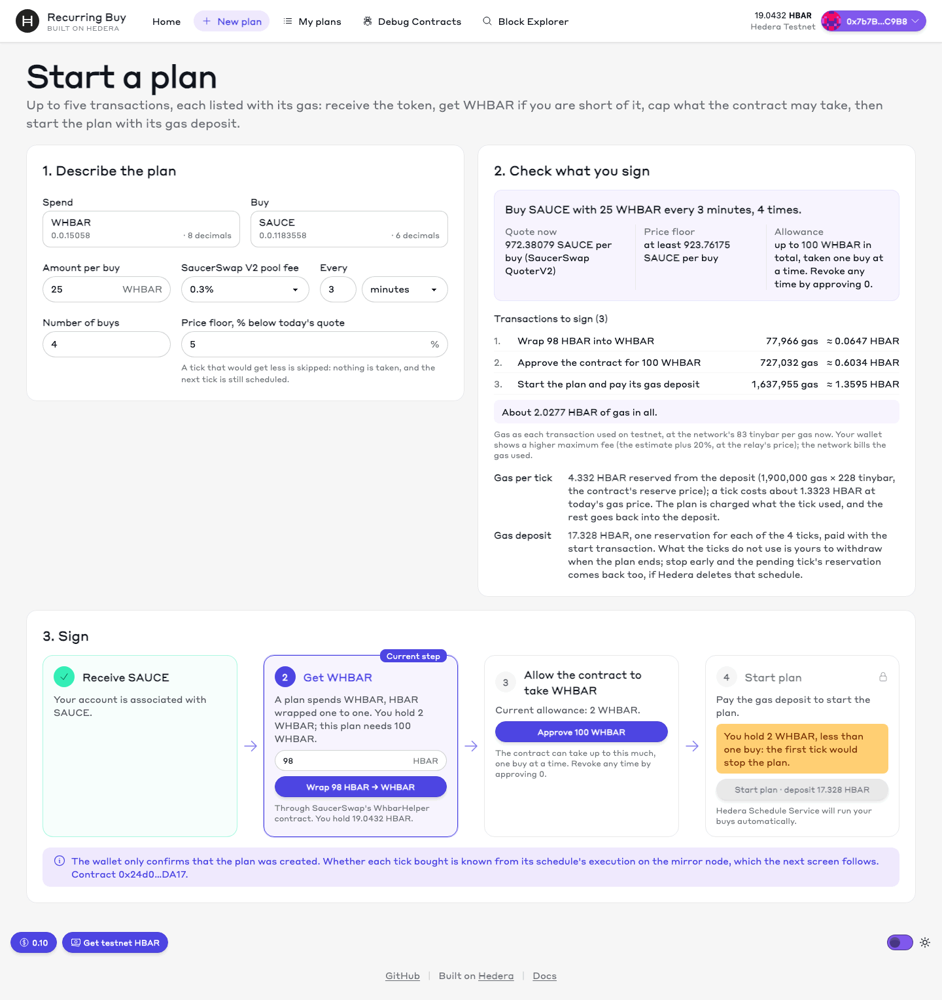
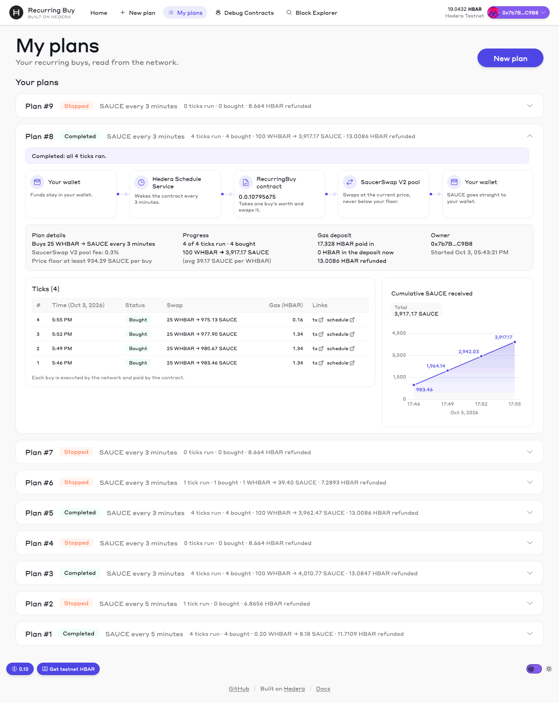

# Recurring Buy: a scaffold-hbar template

Buy a token on SaucerSwap on a schedule: the same amount every hour, day or week. Hedera runs every purchase itself, and your tokens stay in your wallet until the moment each one is spent.

This is a [scaffold-hbar](https://docs.hedera.com/solutions/tools/scaffold-hbar/index) template: a Solidity contract, its tests, and a Next.js app in one workspace. The contract comes with Hardhat or with Foundry, as you choose. It has run on Hedera testnet, with the transactions linked below; the mainnet addresses are in the configuration, but nothing has run on mainnet yet.

**Demo video:** [youtu.be/XttM8F_jFYg](https://youtu.be/XttM8F_jFYg), plans #8 and #9 of the table [Verified on testnet](#verified-on-testnet), started, run and stopped from the app.

**CI** [](https://github.com/retailbox-automation/recurring-buy/actions/workflows/gate.yml): on every push to `main` the [template gate](https://github.com/retailbox-automation/recurring-buy/actions/workflows/gate.yml) scaffolds this template from GitHub with create-scaffold-hbar, then installs, lints, builds, tests and starts the result for 10 combinations of Node version, package manager and framework. [docs/checks.md](docs/checks.md) lists the checks.

## What it does

You describe a plan: "buy SAUCE with 0.05 WHBAR every day, four times, and never accept less than 1.94 SAUCE for a buy". Then:

1. **Limit.** You approve the contract for the plan's total on the token you spend (an HTS allowance). The tokens stay in your wallet. The allowance is the most the contract can ever take, and you can revoke it at any time.
2. **Tick.** At the scheduled second the Hedera Schedule Service calls the contract ([HIP-1215](https://hips.hedera.com/hip/hip-1215)). There is no keeper bot and no server: the contract asked the network for this call, and the network makes it.
3. **Swap.** The contract takes one buy's worth from your wallet and swaps it on SaucerSwap V2 with your account as the recipient. If the pool would give less than your price floor, the tick is skipped: nothing is taken.
4. **Next tick.** As its last step the tick schedules the next one.

Steps 2 to 4 repeat until the plan has run all its ticks, you stop it, or your allowance or balance runs out. Every plan pays for its own ticks from a gas deposit in HBAR, and whatever it does not spend comes back to you. [docs/how-it-works.md](docs/how-it-works.md) explains why this needs no bot on Hedera.



## Screens

A production build (`next build`, `next start`) on testnet, with the wallet that owns the plans of the demo video. Click a screen for full size.

<table>
  <tr>
    <td width="33%"><a href="docs/img/home.png"></a></td>
    <td width="33%"><a href="docs/img/new-plan.png"></a></td>
    <td width="33%"><a href="docs/img/my-plans.png"></a></td>
  </tr>
  <tr>
    <td><code>/</code>: the flow and plan #3, read from the mirror node</td>
    <td><code>/plans/new</code>: the quote, every transaction with its gas, then signing</td>
    <td><code>/plans</code>: plan #8, four ticks run by the network</td>
  </tr>
</table>

## Create a project from this template

```bash
npx create-scaffold-hbar@latest my-app --template retailbox-automation/recurring-buy
```

With `npm create`, put `--` before the CLI's flags: `npm create scaffold-hbar@latest my-app -- --template <owner/repo>`. Without `--`, `npm` keeps `--template` for itself: npm@12 stops with `EUNKNOWNCONFIG Unknown cli flags: --template`, and npm@10 drops the flag, so the CLI falls back to its interactive template prompt. Add `--package-manager npm` for an npm-based project. The examples below use Yarn; in an npm-based project the same scripts run as `npm run <script>`.

The CLI asks for the Solidity framework: Hardhat, the default, or Foundry. `-s hardhat` or `-s foundry` answers without the prompt. Both variants have the same contract, tests of the same behaviour and the same app.

## Prerequisites

- Node.js 20.18.3 or later
- Git with `user.name` and `user.email` set (the CLI makes the first commit)
- Yarn (`corepack enable` installs it), or npm, for npm-based projects
- For the Foundry variant: Foundry 1.7.1 (`foundryup -v v1.7.1`). With forge 1.8 and later, `forge script` fails against Hedera's JSON-RPC relay ([hiero-json-rpc-relay#5826](https://github.com/hiero-ledger/hiero-json-rpc-relay/issues/5826))
- To deploy or to start a plan: a Hedera testnet account with HBAR from the [portal faucet](https://portal.hedera.com/faucet), and an EVM wallet set to Hedera Testnet (chain id 296)

## Look at it first: no wallet, no `.env`

Run `yarn next:dev` and open http://localhost:3000. The home page explains the flow and shows the reference plan set in `packages/nextjs/scaffold.config.ts`, read from the mirror node. `/plans/new` is the form for a plan and `/plans` lists the plans of the connected wallet.

## Deploy the contract to testnet

`RecurringBuy` needs the Schedule Service, so there is nothing to deploy on a local chain. Until you deploy your own, the app uses the contract of the reference plan.

### Deploy with Hardhat

```bash
yarn hardhat:account:generate   # a deployer key, stored encrypted in packages/hardhat/.env
yarn hardhat:deploy:testnet     # asks for the key's password
```

Fund the deployer's address from the faucet between the two commands. The deploy writes the address and ABI to `packages/nextjs/contracts/deployedContracts.ts`, and the app starts using that contract. It used 2,176,533 gas, 2.37 HBAR, on testnet. To show the source on Hashscan, verify it with Sourcify's v2 API as in [packages/hardhat/README.md](packages/hardhat/README.md#verify-the-source): `yarn hardhat:verify:testnet` calls the v1 API, which answered 404 when we tried it. The contract's tests run on mocks: `yarn hardhat:test`.

### Deploy with Foundry

```bash
yarn foundry:account:generate   # a deployer key, in an encrypted keystore in ~/.foundry/keystores
yarn foundry:deploy:testnet     # asks for the keystore password
```

Fund the address the first command prints before the second. The deploy writes `deployedContracts.ts` the same way; it used 2,134,668 gas, 2.33 HBAR, on testnet. [packages/foundry/README.md](packages/foundry/README.md) has the command that verifies the source on Sourcify. The same tests, in Solidity: `yarn foundry:test`.

## Start a plan: what you sign and what it costs

On `/plans/new` you fill in the pair, the amount per buy, the period, the number of buys and the price floor. Before you sign anything, the page shows a live quote from SaucerSwap's QuoterV2 and every transaction with its gas. You sign up to five, the first four only when needed:

| # | Transaction | Gas on testnet |
| --- | --- | --- |
| 1 | Associate the token you buy (HIP-719), even if your account associates tokens automatically | 726,488 gas, 0.79 HBAR |
| 2 | Associate the token you spend: WHBAR before a wrap, any other token before the approval | 726,488 gas, 0.79 HBAR |
| 3 | Wrap HBAR into WHBAR through SaucerSwap's WhbarHelper, as much as the plan is short of | 77,966 gas, 0.085 HBAR |
| 4 | Approve the contract for the plan's total on the token you spend | 727,032 gas, 0.79 HBAR |
| 5 | Start the plan and pay its gas deposit | 1,637,955 gas, 1.79 HBAR; 1,476,561 gas more for the first plan on a spend token |

After that nobody signs anything. A tick costs about 1.75 HBAR in gas whatever the size of the buy (at 2026-09-30's gas price; `/plans/new` shows today's), paid from the plan's gas deposit. The app reserves 4.332 HBAR per tick up front, and what the ticks do not use comes back to you. Reservations, settlement and gas prices in detail: [docs/costs.md](docs/costs.md).

## Stop a plan

- On `/plans`, **Stop and refund deposit** calls `stop(planId, refundTo)`. The contract asks Hedera to delete the pending tick's schedule and sends you the deposit. If Hedera confirms the deletion, the pending tick's reservation comes back too.
- Or revoke the allowance: approve 0 on the token you spend. This needs nothing from the contract. The next tick fails to take its amount, ends the plan and buys nothing.
- A plan that has ended by itself (all ticks done, allowance or balance short, deposit too low for another reservation) keeps what is left of its deposit until you press **Withdraw** on `/plans`.

## Hedera services it uses

| Service | What the template does with it | Code | On testnet |
| --- | --- | --- | --- |
| Schedule Service, `scheduleCall` ([HIP-1215](https://hips.hedera.com/hip/hip-1215)) | `start` schedules tick 1, and every tick but the last schedules the next one, with the contract as payer | [`_scheduleTick`](https://github.com/retailbox-automation/recurring-buy/blob/26460f9fe6e2135cfa7cba98342c1fc95a38831b/packages/hardhat/contracts/RecurringBuy.sol#L303-L318) | plan #8, tick 1: schedule [0.0.10847683](https://hashscan.io/testnet/schedule/0.0.10847683), run at [1791063980.122177208](https://hashscan.io/testnet/transaction/1791063980.122177208) |
| Schedule Service, `hasScheduleCapacity` | picks a second with room for the tick's gas: the ideal one, else 1, 2, 4, 8 or 16 s later | [`_secondWithCapacity`](https://github.com/retailbox-automation/recurring-buy/blob/26460f9fe6e2135cfa7cba98342c1fc95a38831b/packages/hardhat/contracts/RecurringBuy.sol#L322-L328) | called before each `scheduleCall` above |
| Schedule Service, `deleteSchedule` | `stop` deletes the pending tick and refunds its reservation | [`stop`](https://github.com/retailbox-automation/recurring-buy/blob/26460f9fe6e2135cfa7cba98342c1fc95a38831b/packages/hardhat/contracts/RecurringBuy.sol#L256-L273) | plan #9: [`stop`](https://hashscan.io/testnet/transaction/1791065283.318878179), schedule [0.0.10847944](https://hashscan.io/testnet/schedule/0.0.10847944) deleted, never run |
| Token Service: HTS allowance | you approve the plan's total; each tick takes one buy with `transferFrom` | app: [`approve`](https://github.com/retailbox-automation/recurring-buy/blob/26460f9fe6e2135cfa7cba98342c1fc95a38831b/packages/nextjs/components/recurring-buy/NewPlanForm.tsx#L415-L430); contract: [`buy`](https://github.com/retailbox-automation/recurring-buy/blob/26460f9fe6e2135cfa7cba98342c1fc95a38831b/packages/hardhat/contracts/RecurringBuy.sol#L219-L237) | plan #8: [approve 100 WHBAR](https://hashscan.io/testnet/transaction/1791063795.659713160); each of its ticks |
| Token Service: HIP-719 `associate()` | you associate the token you buy, and WHBAR before a wrap; the contract associates itself with each spend token once | [`associateCalldata`](https://github.com/retailbox-automation/recurring-buy/blob/26460f9fe6e2135cfa7cba98342c1fc95a38831b/packages/saucerswap/src/associate.ts#L10), [`_prepareToken`](https://github.com/retailbox-automation/recurring-buy/blob/26460f9fe6e2135cfa7cba98342c1fc95a38831b/packages/hardhat/contracts/RecurringBuy.sol#L282-L291) | run E: [associate SAUCE](https://hashscan.io/testnet/transaction/1790790790.052318809) |
| Token Service, `getTokenInfo` | caps the router's approval at the maximum supply of a finite-supply token, which refuses more | [`_largestAllowance`](https://github.com/retailbox-automation/recurring-buy/blob/26460f9fe6e2135cfa7cba98342c1fc95a38831b/packages/hardhat/contracts/RecurringBuy.sol#L295-L299) | run E: [`start`](https://hashscan.io/testnet/transaction/1790790834.555078365) of the first plan on WHBAR |
| Smart Contract Service | `RecurringBuy` holds every plan and swaps on SaucerSwap V2 with `exactInput` | [`RecurringBuy.sol`](https://github.com/retailbox-automation/recurring-buy/blob/26460f9fe6e2135cfa7cba98342c1fc95a38831b/packages/hardhat/contracts/RecurringBuy.sol) | contract [0.0.10795675](https://hashscan.io/testnet/contract/0.0.10795675) |
| Mirror node REST API | the app reads each schedule's execution and each tick's result, and the gas price the network bills | [`scheduleState`, `fetchExecution`](https://github.com/retailbox-automation/recurring-buy/blob/26460f9fe6e2135cfa7cba98342c1fc95a38831b/packages/nextjs/utils/recurring-buy/mirror.ts#L100-L127) | [schedule 0.0.10847683](https://testnet.mirrornode.hedera.com/api/v1/schedules/0.0.10847683) and [its tick](https://testnet.mirrornode.hedera.com/api/v1/contracts/0.0.10795675/results/1791063980.122177208) |

The code links point at commit `26460f9`.

## Verified on testnet

This template's contract, deployed from this repository on 2026-09-30, plan #3, the reference plan the home page shows, and plans #8 and #9, the plans in the demo video. Nobody sent a transaction for any tick: the network ran each one at its scheduled second. To check a tick yourself, see [docs/verify-ticks.md](docs/verify-ticks.md).

| What | Link |
| --- | --- |
| RecurringBuy contract, source verified on Sourcify: `exact_match` of the creation and the runtime code | [0.0.10795675](https://hashscan.io/testnet/contract/0.0.10795675) |
| Plan #3 (25 WHBAR → SAUCE every 3 minutes, 4 buys): `start` transaction | [1790868703.048104104](https://hashscan.io/testnet/transaction/1790868703.048104104) |
| Tick 1, run by the network: bought 1,006.88 SAUCE and scheduled tick 2 | schedule [0.0.10810809](https://hashscan.io/testnet/schedule/0.0.10810809), run at [1790868883.063783046](https://hashscan.io/testnet/transaction/1790868883.063783046) |
| Ticks 2 to 4: each bought; tick 4 completed the plan | [1790869062.014332390](https://hashscan.io/testnet/transaction/1790869062.014332390), [1790869240.047172656](https://hashscan.io/testnet/transaction/1790869240.047172656), [1790869419.027257104](https://hashscan.io/testnet/transaction/1790869419.027257104) |
| Withdraw: the unused deposit of plan #3 back to its owner | [1790869859.787129293](https://hashscan.io/testnet/transaction/1790869859.787129293) |
| Plan #8, the demo video's plan (25 WHBAR → SAUCE every 3 minutes, 4 buys): wrap, approve and `start` | [1791063789.257899200](https://hashscan.io/testnet/transaction/1791063789.257899200), [1791063795.659713160](https://hashscan.io/testnet/transaction/1791063795.659713160), [1791063801.801587104](https://hashscan.io/testnet/transaction/1791063801.801587104) |
| Plan #8's ticks, run by the network: bought 983.46, 980.67, 977.90 and 975.13 SAUCE | schedule [0.0.10847683](https://hashscan.io/testnet/schedule/0.0.10847683) run at [1791063980.122177208](https://hashscan.io/testnet/transaction/1791063980.122177208), then [1791064160.002043208](https://hashscan.io/testnet/transaction/1791064160.002043208), [1791064339.037915854](https://hashscan.io/testnet/transaction/1791064339.037915854), [1791064517.034955392](https://hashscan.io/testnet/transaction/1791064517.034955392) |
| Withdraw: plan #8's unused deposit, 13.0086 HBAR, back to its owner | [1791065135.136112104](https://hashscan.io/testnet/transaction/1791065135.136112104) |
| Plan #9 stopped before its first tick: schedule deleted, never run, 8.664 HBAR refunded | `start` [1791065262.139307322](https://hashscan.io/testnet/transaction/1791065262.139307322), `stop` [1791065283.318878179](https://hashscan.io/testnet/transaction/1791065283.318878179); schedule [0.0.10847944](https://hashscan.io/testnet/schedule/0.0.10847944) |
| A skipped tick: plan #2's floor was above the price, nothing taken, next tick scheduled | schedule [0.0.10795970](https://hashscan.io/testnet/schedule/0.0.10795970), run at [1790792373.084332104](https://hashscan.io/testnet/transaction/1790792373.084332104) |
| `stop`: pending schedule deleted, deposit and its reservation refunded | [1790792387.304319777](https://hashscan.io/testnet/transaction/1790792387.304319777); schedule [0.0.10796029](https://hashscan.io/testnet/schedule/0.0.10796029) deleted, never run |
| Wrap 0.1 HBAR into WHBAR with the transaction `/plans/new` sends | [1790794391.315370441](https://hashscan.io/testnet/transaction/1790794391.315370441) |
| The same contract deployed with the Foundry variant, source verified on Sourcify: `exact_match` of the runtime code; the creation code was not compared | [0.0.10796292](https://hashscan.io/testnet/contract/0.0.10796292) |

Gas, fees and balances for every row are in runs E to J of [docs/testnet-findings.md](docs/testnet-findings.md). Before this template, a prototype of the contract ran the same mechanism: [0.0.10777783](https://hashscan.io/testnet/contract/0.0.10777783), run B.

## What this template does not do

- **Mainnet.** Nothing has run on mainnet. Its addresses (SaucerSwap's router, QuoterV2, WHBAR and WhbarHelper) are in `packages/saucerswap/src/addresses.ts` and the deploy scripts, taken from SaucerSwap's documentation, and none has carried a transaction of ours.
- **Other pools on testnet.** The form accepts any HTS token and fee, but on testnet only the WHBAR/SAUCE pool at fee 3000 (0.3%) is known to exist: `getPool` returned the zero address for 500, 1500 and 10000 ([testnet-findings.md](docs/testnet-findings.md)).
- **Routes through several pools.** A plan swaps through one SaucerSwap V2 pool.
- **Spending HBAR itself.** The token you spend is an HTS token, so HBAR is wrapped into WHBAR first; `/plans/new` does it as one of its steps.
- **Shared plans.** A plan belongs to the account that sent `start`. Only that account can stop it and take its deposit, and no one else signs anything for its buys.
- **Changing a running plan.** Amount, period and price floor are fixed at `start`, and the floor is an absolute amount. Stop the plan and start another; `topUp` only adds to the gas deposit.
- **An audit.** The contract has tests, not a security review.

[Known limitations](docs/how-it-works.md#known-limitations) lists the rest, with what has not yet been checked on a live network.

## Troubleshooting

| Symptom | Cause | What to do |
| --- | --- | --- |
| The relay rejects a transaction: "Gas price … is below configured minimum" | Fees taken from hashio's block header, whose base fee is far below the price the relay accepts (C1) | Send `eth_gasPrice` as the maximum fee and no priority fee, as `useHederaFees` in `packages/nextjs/hooks/recurring-buy/useRecurringBuy.ts` does |
| Every tick of a plan is skipped; the swap failed with SaucerSwap's `TransferFail(21)` | The owner relied on an automatic association of the token bought, and that association needs more gas than a tick leaves for its swap (F2, D3) | Associate the token first. `/plans/new` asks for it even when the account associates tokens automatically |
| Wrapping HBAR reverts with `Safe token transfer failed!` and `TOKEN_NOT_ASSOCIATED_TO_ACCOUNT` | The account is not associated with WHBAR and has no free automatic association (D2) | Associate WHBAR, then wrap; `/plans/new` puts the association first |
| `/plans/new` says "less than one buy", or a plan ended at its first tick because the pull failed | A tick takes one buy's worth of the token you spend, under the allowance; a short balance or allowance ends the plan | Wrap or buy enough of the token and approve the plan's total before `start` |
| `stop` from a script fails with `INSUFFICIENT_GAS` | The gas limit came from `eth_estimateGas`, and a `stop` that deletes a pending schedule used 118,556 gas, more than estimated (I1, F3) | Give it a margin. The app sends at least 118,556 plus 20% (`stopGasLimit` in `packages/nextjs/utils/recurring-buy/costs.ts`) |
| `/plans` shows "Chain broken" | A tick reverted as a whole, for example out of gas, so nothing is scheduled while the contract still calls the plan active (B9) | Stop the plan: `stop` returns the deposit, but not that tick's reservation |
| create-scaffold-hbar makes a Foundry project, or stops with `FoundryValidationError: Could not parse foundry version` | It could not read `template.json` from GitHub, where it sends no token (60 requests an hour per IP address), and used its own defaults | Name the framework and package manager: add `-s hardhat --package-manager yarn` ([cli-manifest-fallback.md](docs/cli-manifest-fallback.md)) |
| `forge script` fails against the relay | forge 1.8 and later ([hiero-json-rpc-relay#5826](https://github.com/hiero-ledger/hiero-json-rpc-relay/issues/5826)) | Use Foundry 1.7.1: `foundryup -v v1.7.1` |
| `yarn hardhat:verify:testnet` gets a 404 | hardhat-verify 2.1.3 calls Sourcify's v1 API (C2) | Verify with Sourcify's v2 API, as in [packages/hardhat/README.md](packages/hardhat/README.md#verify-the-source) |

The labels (C1, F2, …) are findings in [docs/testnet-findings.md](docs/testnet-findings.md).

## Pitfalls we measured

[docs/pitfalls.md](docs/pitfalls.md) lists ten ways a recurring buy on Hedera fails that we hit or measured on testnet, each with its finding and the code and test that keep it from happening here: a tick guarded by time, a tick that reverts as a whole, too little gas left for the next schedule, an automatic association inside a swap, a wrap without a WHBAR association, an approval above a token's maximum supply, fees taken from the block header, an expired schedule on the mirror node, a tick read by its nonce, and a `stop` that runs out of gas.

## Environment variables

None is required: the app builds and runs without a `.env`. The Foundry variant uses no `.env` at all.

| Variable | File | Purpose |
| --- | --- | --- |
| `DEPLOYER_PRIVATE_KEY_ENCRYPTED` | `packages/hardhat/.env` | The deployer key, written by `yarn hardhat:account:generate` or `yarn hardhat:account:import`. Do not fill it in by hand |
| `HEDERA_RPC_URL` | `packages/hardhat/.env` | JSON-RPC endpoint the Hardhat network forks from. Default: hashio testnet |
| `NEXT_PUBLIC_HEDERA_TESTNET_RPC_URL`, `NEXT_PUBLIC_HEDERA_MAINNET_RPC_URL` | `packages/nextjs/.env.local` | JSON-RPC endpoints for the app. Default: hashio |
| `NEXT_PUBLIC_WALLET_CONNECT_PROJECT_ID` | `packages/nextjs/.env.local` | Your WalletConnect project id |
| `NEXT_PUBLIC_ENABLE_BURNER_WALLET` | `packages/nextjs/.env.local` | `true` adds a burner wallet whose key lives in the browser. For automated tests and local demos only. Read at build time |

## Repository layout

```
packages/hardhat      RecurringBuy.sol with its interfaces and mocks, its tests, the deploy script
packages/foundry      the same contracts/, the tests in Solidity, a forge deploy script
packages/nextjs       the app
  app/                  routes /, /plans/new and /plans; the starter's /debug and /blockexplorer
  components/recurring-buy/    the screens
  hooks/recurring-buy/         reading plans, sending transactions
  utils/recurring-buy/         plan history, mirror node, costs: no React, tested on recorded data
packages/saucerswap   @sh/saucerswap: SaucerSwap V2 addresses, quotes, association, wrapping
docs                  testnet findings, costs, how it works, checks; img/ holds the screens
tools/gate            the template's eligibility checks, run by .github/workflows/gate.yml
.harness              Hedera Harness recipe, validators and brief
template.json         the manifest create-scaffold-hbar reads, then deletes from new projects
```

A project created from the template has `packages/hardhat` or `packages/foundry`, not both.

## More

[How it works](docs/how-it-works.md) (the contract, the Hedera services in a tick, the layout, known limitations) · [Costs](docs/costs.md) · [Checking a tick](docs/verify-ticks.md) · [Template checks and Hedera Harness](docs/checks.md) · [When the CLI cannot read template.json](docs/cli-manifest-fallback.md) · [Everything measured on testnet](docs/testnet-findings.md) · [Pitfalls we measured](docs/pitfalls.md) · [The Foundry package](packages/foundry/README.md) · [AGENTS.md](AGENTS.md), for changing the template with or without a coding agent.

## License

MIT, see [LICENSE](LICENSE). The starter is Copyright (c) 2023 BuidlGuidl and (c) 2026 hedera-dev; [PROVENANCE.md](PROVENANCE.md) lists what is starter code and what was added.
